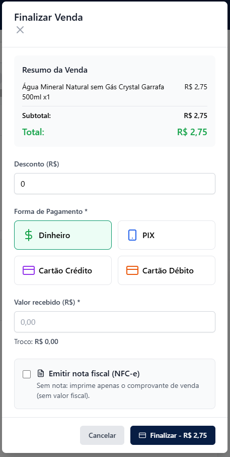
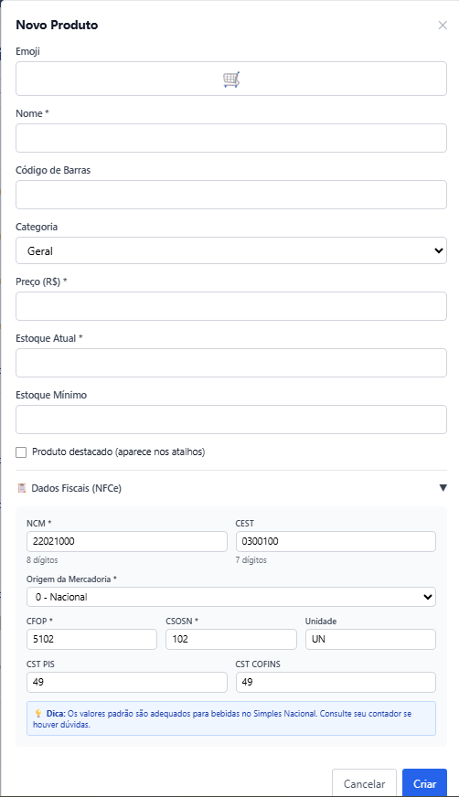
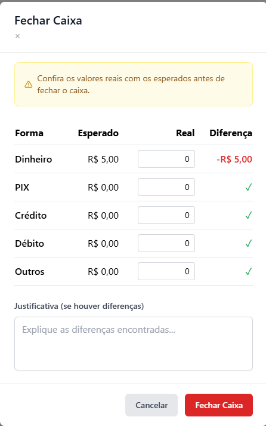
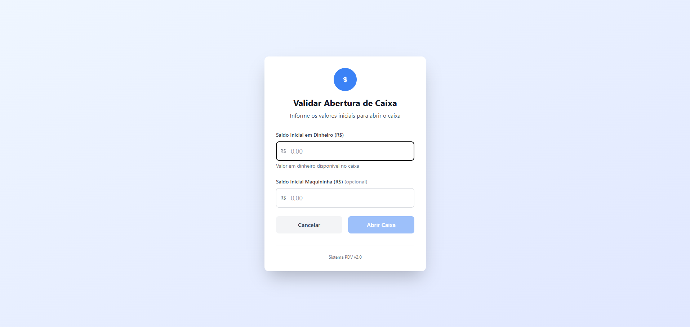
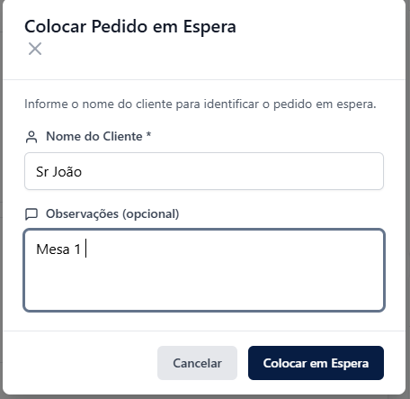
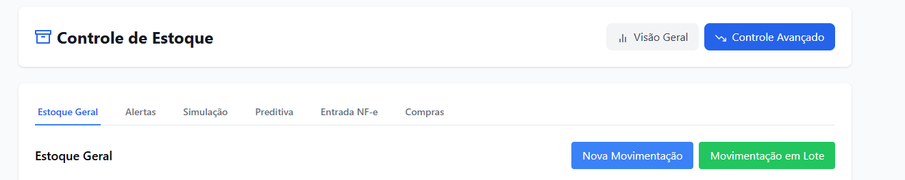
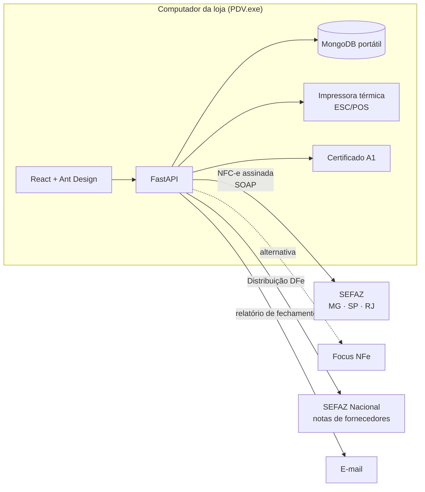

  

# Max PDV: Sistema de Ponto de Venda

> **Código-fonte privado.** Este repositório é uma vitrine do projeto: funcionalidades,
> arquitetura e telas. O código pode ser apresentado sob solicitação.

Sistema de ponto de venda completo para o varejo, **em produção** em um comércio com
catálogo de ~600 produtos. Cobre o dia inteiro da loja: abertura de caixa, venda no
balcão, emissão de **NFC-e** direto na SEFAZ, impressão térmica, estoque, entrada de
notas de fornecedores e fechamento com conferência.

Distribuído como **um único `.exe`**: a pessoa da loja dá duplo clique e o sistema
se instala sozinho, com banco de dados embutido e sem depender de internet para vender.

---

## Em números

| | |
| --- | --- |
| ~99 endpoints de API | FastAPI assíncrono |
| ~15 mil linhas de código | 6 mil em Python + 9 mil em React |
| ~600 produtos | com classificação fiscal (NCM, CEST, CFOP, CSOSN) |
| 1 executável | instalação automática com MongoDB portátil |

---

## Telas

<table>
  <tr>
    <td align="center"> Finalizar venda: formas de pagamento, troco e NFC-e</td>
    <td align="center"> Cadastro de produto com dados fiscais</td>
    <td align="center"> Fechamento com conferência esperado × real</td>
  </tr>
</table>

   
  Abertura de caixa com saldo inicial em dinheiro e maquininha

<table>
  <tr>
    <td align="center"> Pedidos em espera (mesa/cliente)</td>
    <td align="center"> Estoque avançado: alertas, simulação, preditiva, entrada de NF-e e compras</td>
  </tr>
</table>

---

## Arquitetura

---

## Funcionalidades

### Venda no balcão
- Grade de mais vendidos, filtro por categoria e busca por **código de barras**.
- Carrinho com desconto, **várias formas de pagamento** (dinheiro, PIX, crédito, débito) e troco.
- **Pedidos em espera** por nome do cliente/mesa, para atender vários ao mesmo tempo.
- CPF/CNPJ na nota, quando o cliente pede.

### Fiscal (NFC-e modelo 65, layout 4.00)
- **Emissão direta na SEFAZ** via SOAP, com XML montado e **assinado digitalmente** com o
  certificado e-CNPJ A1 (lxml + signxml), ou por **API externa** (Focus NFe), configurável.
- Suporte a homologação e produção, com URLs por estado (MG, SP, RJ).
- Cancelamento de nota, DANFE com **QR Code** e controle de custo por nota emitida.
- **Entrada de NF-e de fornecedores** por XML, chave de acesso ou download automático via
  **Distribuição DFe** da SEFAZ Nacional.

### Caixa
- Abertura com saldo inicial (dinheiro e maquininha), sangrias e suprimentos.
- **Fechamento com conferência** do valor esperado × real por forma de pagamento, com
  justificativa obrigatória em caso de diferença.
- Relatório de fechamento enviado **por e-mail** automaticamente.
- Taxas de maquininha por bandeira, para o resultado líquido real.

### Estoque
- Movimentações individuais e **em lote**, com histórico.
- Alertas de estoque mínimo, **simulação** e visão **preditiva** de reposição.
- Sugestão de compras a partir do giro.

### Gestão
- Dashboard com indicadores do dia e do mês (Chart.js).
- Relatórios gerenciais de vendas, estoque e financeiro.
- **Controle de acesso** por usuário, com matriz de permissões por tela.

### Engenharia
- **Impressão térmica ESC/POS sem biblioteca de impressão**: os bytes do protocolo são
  montados à mão, e o QR Code é rasterizado direto no formato da impressora, sem Pillow.
- **Auto-instalação**: na primeira execução o `.exe` gera uma chave JWT única por loja,
  sobe o MongoDB portátil (e instala o runtime C++ se faltar) e restaura o banco inicial.
  Nas seguintes, só reaproveita o que já existe.
- Ferramentas de apoio ao contador: planilhas de **validação fiscal** geradas direto do
  banco, agrupadas por NCM + CSOSN + CEST, para validar dezenas de grupos em vez de centenas
  de linhas.
- Autenticação JWT com senhas em **bcrypt**.

---

## Stack

| Camada | Tecnologias |
| --- | --- |
| **Back-end** | Python 3.12, FastAPI, Uvicorn, Pydantic 2, Motor (MongoDB assíncrono), PyJWT, bcrypt |
| **Fiscal** | lxml, signxml, cryptography/pyOpenSSL (certificado A1), zeep (SOAP), ReportLab, qrcode |
| **Front-end** | React 18, Ant Design 5, Chart.js, React Router, Axios |
| **Distribuição** | PyInstaller (executável único), MongoDB portátil, instalação automática |
| **Hardware** | Impressoras térmicas ESC/POS (Epson TM-T20X e compatíveis) |

---

## Contato

Desenvolvido por **Halyson Henrique**. Quer ver o código ou uma demonstração?
Entre em contato pelo [LinkedIn](https://www.linkedin.com/) ou pelo [GitHub](https://github.com/halysonhenrique).
